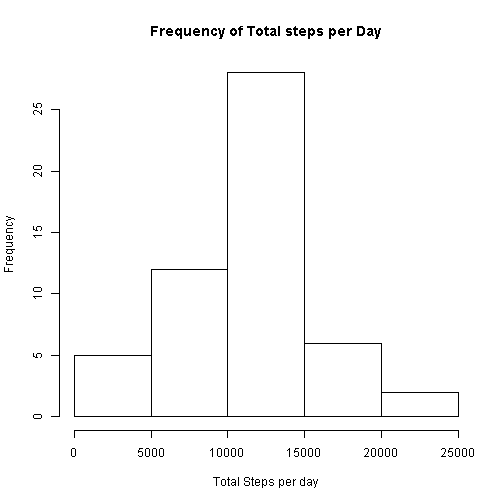
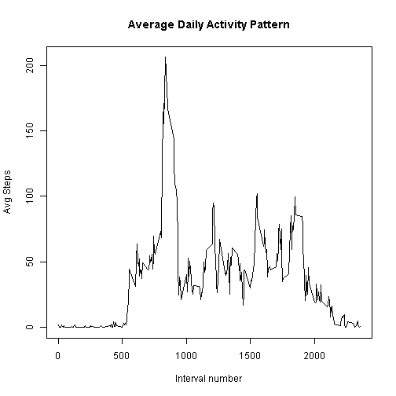
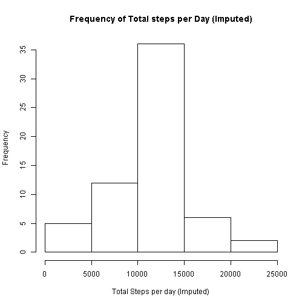
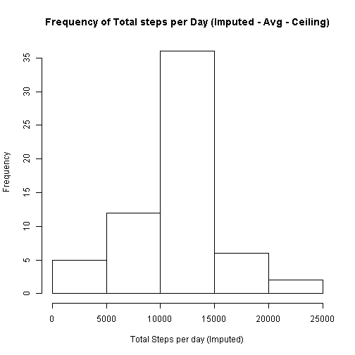
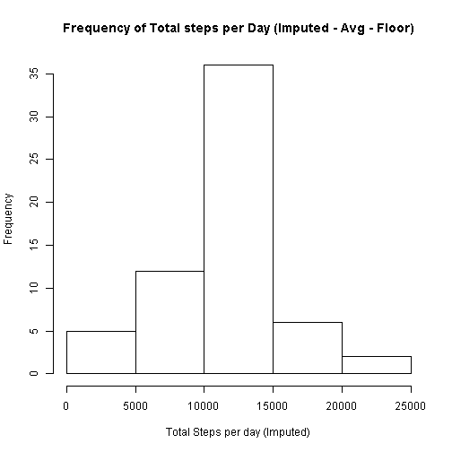
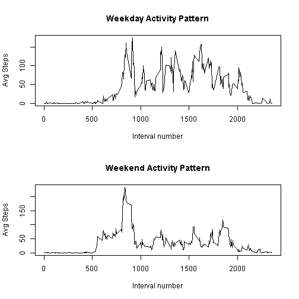

## Loading and preprocessing the data

```r
df <- read.csv("activity.csv", header=TRUE, sep=",", na.strings="NA")

df$date = as.Date(as.character(df$date), "%Y-%m-%d")
dfClean <- na.omit(df)
```

## What is mean total number of steps taken per day?
The following shows a histogram of the total steps taken per day.


```r
histData = tapply(dfClean$steps, dfClean$date, sum)
hist(histData, xlab="Total Steps per day", main="Frequency of Total steps per Day")
```

 

The mean and median number of steps taken per day were calculated as follows:


```r
meanSteps <- mean(histData)
medianSteps <- median(histData)
```

 The mean total number of steps taken per day: **10766.19**
 The median total number of steps taken per day: **10765.00**

## What is the average daily activity pattern?

```r
intervalNum <- unique(dfClean$interval)
avgStepsPerInterval <- tapply(dfClean$steps, dfClean$interval, mean)

plot(intervalNum, avgStepsPerInterval, type='l', 
      main="Average Daily Activity Pattern",
      xlab="Interval number",
      ylab="Avg Steps")
```

 

```r
maxInterval <- names(which.max(avgStepsPerInterval))
```

Interval number **835** has the maximum average steps.

## Imputing missing values


```r
totalMissing = sum(is.na(df$steps))
```

The number of missing values is **2304**. 

For the next step these values will be replace with the average step count for that interval number.


```r
dfCompleted <- df

imputedValue <- function(steps, interval, howtoRound)
{
  if(is.na(steps))
  {
    val = steps
    # 0 = none, 1 = ceiling, 2 = floor, 3 = trunc
    switch(howtoRound,
           "none" = val <- avgStepsPerInterval[[as.character(interval)]],
           "ceiling" = val <- ceiling(avgStepsPerInterval[[as.character(interval)]]),
           "floor" = val <- floor(avgStepsPerInterval[[as.character(interval)]]),
           "trunc" = val <- trunc(avgStepsPerInterval[[as.character(interval)]])
           )
    val
  }
  else
  {
    steps
  }
}

dfCompleted$steps <- mapply(imputedValue, dfCompleted$steps, dfCompleted$interval, "none")
histDataCompleted = tapply(dfCompleted$steps, dfCompleted$date, sum)
hist(histDataCompleted, xlab="Total Steps per day (Imputed)", main="Frequency of Total steps per Day (Imputed)")
```

 

The mean and median number of steps taken per day after imputation were calculated as follows:


```r
meanStepsCompleted <- mean(histDataCompleted)
medianStepsCompleted <- median(histDataCompleted)
```

The mean total number of steps taken per day with imputation (pure avg): **10766.19**

The median total number of steps taken per day with imputation (pure avg): **10766.19**

------------------------------------------------------------------------------------------------
To answer the following question posited in the assignment:
Do these values differ from the estimates from the first part of the assignment? What is the impact of imputing missing data on the estimates of the total daily number of steps?

The asnwer is: The affect depends on if, and how, you round the average number of steps.  Initially, with no rounding, I got what I thought was a strange.  The average was exactly the same and the median was exactly the same as the mean.  It makes sense that the mean would remain the same, that value would remain constant since every new value is equal to the mean.  

However, the problem is this infers that we are calculating partial steps.  So, I tried rounding the numbers to see if that would change the mean and median, and by how much.  

My conclusion is that you have to be careful how you impute data, and what the imputing means in terms of the real data.  In this case, it makes sense to use the median or a rounded mean since in our actual data we do not have partial steps.  

------------------------------------------------------------------------------------------------


```r
dfCompleted <- df

dfCompleted$steps <- mapply(imputedValue, dfCompleted$steps, dfCompleted$interval, "ceiling")
histDataCompleted = tapply(dfCompleted$steps, dfCompleted$date, sum)
hist(histDataCompleted, xlab="Total Steps per day (Imputed)", main="Frequency of Total steps per Day (Imputed - Avg - Ceiling)")
```

 

The mean and median number of steps taken per day after imputation (rounding up) were calculated as follows:


```r
meanStepsCompleted <- mean(histDataCompleted)
medianStepsCompleted <- median(histDataCompleted)
```

The mean total number of steps taken per day with imputation (rounding up): **10784.92**

The median total number of steps taken per day with imputation (rounding up): **10909.00**

------------------------------------------------------------------------------------------------

```r
dfCompleted <- df

dfCompleted$steps <- mapply(imputedValue, dfCompleted$steps, dfCompleted$interval, "floor")
histDataCompleted = tapply(dfCompleted$steps, dfCompleted$date, sum)
hist(histDataCompleted, xlab="Total Steps per day (Imputed)", main="Frequency of Total steps per Day (Imputed - Avg - Floor)")
```

 

The mean and median number of steps taken per day after imputation (rounding down) were calculated as follows:


```r
meanStepsCompleted <- mean(histDataCompleted)
medianStepsCompleted <- median(histDataCompleted)
```


The mean total number of steps taken per day with imputation (rounding up): **10749.77**
The median total number of steps taken per day with imputation (rounding up): **10641.00**


## Are there differences in activity patterns between weekdays and weekends?

So to start, creating new data frame with new columns "isWeekday" and "day"


```r
dfWeekendCompare <- dfClean
dfWeekendCompare$day <- weekdays(as.Date(dfWeekendCompare$date))
dfWeekendCompare$isWeekend <- 0
dfWeekendCompare$isWeekend[which(dfWeekendCompare$day == "Saturday")] <- 1
dfWeekendCompare$isWeekend[which(dfWeekendCompare$day == "Sunday")] <- 1
```

Once we have the data we want in the columns, the data is broken by the 2 different groups (weekday and Weekend).  After using tapply to find the mean by interval, those values are plotted in the same fashion as was done earlier.


```r
dfWeekend <- dfWeekendCompare[dfWeekendCompare$isWeekend == 0,]
dfWeekday <- dfWeekendCompare[dfWeekendCompare$isWeekend == 1,]

weekdayAvg <- tapply(dfWeekday$steps, dfWeekday$interval, mean)
weekendAvg <- tapply(dfWeekend$steps, dfWeekend$interval, mean)

par(mfcol=c(2,1))

weekdDayIntervalNum <- unique(dfWeekday$interval)
plot(weekdDayIntervalNum, weekdayAvg, type='l', 
      main="Weekday Activity Pattern",
      xlab="Interval number",
      ylab="Avg Steps")

weekdendIntervalNum <- unique(dfWeekend$interval)
plot(weekdendIntervalNum, weekendAvg, type='l', 
      main="Weekend Activity Pattern",
      xlab="Interval number",
      ylab="Avg Steps")
```

 

In comparison of weekend vs. weekday, it looks like there are greater spikes of activity on the weekend.  However, the acivity is more consistent during the weekdays, with a lower peak.  
